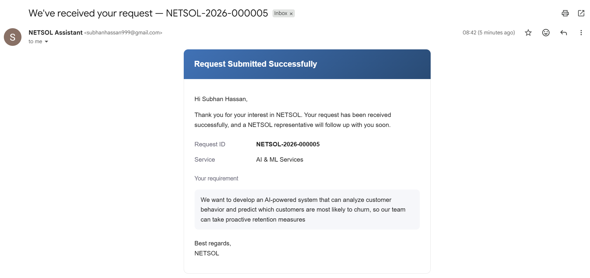
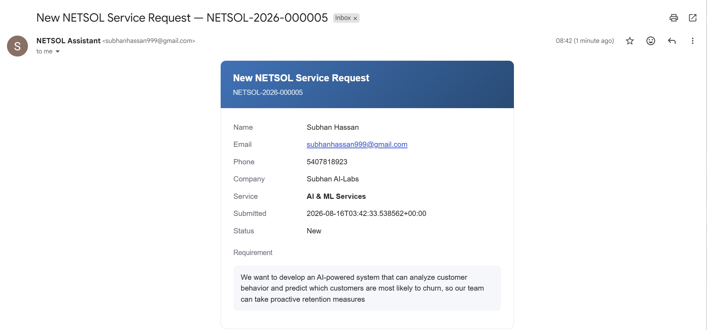

# NETSOL AI Assistant

An AI assistant built for NETSOL Technologies that answers questions about the company, looks up employee records, reads whatever document or spreadsheet you hand it, and carries a real conversation with potential customers to capture and qualify service leads. No separate admin panel, no forms, no card-based menus bolted onto a chatbot. One chat interface, one model, several different ways of getting an answer depending on what's actually being asked.

## Demo

**The assistant in action**


When a service request is submitted, two emails go out automatically: one confirming the request to the customer, and one notifying NETSOL internally.

**Customer confirmation**



**Internal NETSOL notification**



## The problem this solves

Before this existed, someone looking for information about NETSOL had three separate places to check: the public website, an internal employee spreadsheet, and whatever documents happened to be floating around. None of those talk to each other, and none of them can hold a conversation. This assistant sits in front of all three, figures out which source actually has the answer, and when someone shows up looking to become a customer rather than just get information, recognizes that shift and moves into a proper intake conversation instead of pointing them at a contact form.

## What it actually does

**Answers questions about NETSOL from its real website content.** `ingest.py` crawls netsolpk.com and the related netsoltech.com product/service/solution pages, strips navigation and boilerplate, and keeps the footer content separately since that's where the address and contact details live. Everything gets chunked and embedded into a persistent ChromaDB collection (currently 78 chunks across roughly 40 pages).

**Answers questions about employees from a live SQL database.** The employee data arrives as a nested, MongoDB-shaped JSON export, not a flat CSV, so `ingest.py` walks every record generically: scalar fields become columns in an `employees` table, and any field that holds a list (education, job history, skills, certifications, promotion history, and so on) gets its own relational table with a foreign key back to the employee. Nothing about which fields exist is hardcoded, which matters because the very first version of this *did* hardcode the schema and silently dropped several fields the export actually had. Add a new field to the source JSON, re-run ingestion, and it shows up as a queryable table with no code changes, since the Text2SQL prompt reads the schema straight from `sqlite_master`.

**Routes each question intelligently.** A LangGraph state machine sits between the person and the two data sources. Keyword pre-routing catches the obvious cases cheaply; anything ambiguous goes through an LLM classifier that decides between website knowledge, employee SQL, both, or neither, before a single expensive call is made.

**Handles uploaded files as a first-class source.** Upload a CSV and questions about it get answered by generating real pandas code and running it against the actual dataframe, not the model guessing at numbers from a text summary. Upload a PDF or text file and it gets extracted and treated as grounding context for that session. Either way it takes over as the primary source for that conversation until cleared.

**Talks people through a service inquiry instead of handing them a form.** When someone expresses interest in NETSOL's services, in plain conversational language rather than by clicking a button, the assistant recognizes that intent, lists the actual services NETSOL offers (pulled from the same catalog data, not invented), asks what they're looking for, collects contact details one message at a time, summarizes everything back for confirmation, and only then creates the lead. Two emails go out on submission: an internal notification and a confirmation to the customer, sent independently so a failed email never costs the lead itself. The request is written to the database before either email is attempted.

**Tracks exactly what every request costs.** Every Gemini call is logged with model, input/output tokens, and computed cost against the actual published pricing. A single `/chat` request can trigger several calls under the hood (routing, SQL generation, synthesis, retries) and they're all rolled into one summary per request, plus a running total for the life of the server.

## Architecture

```
                         ┌─────────────────┐
                         │   ingest.py      │   run once / on refresh
                         │  (scrape + load) │
                         └────────┬─────────┘
                                  │
                 ┌────────────────┴────────────────┐
                 ▼                                  ▼
         ChromaDB (chroma_db/)              SQLite (netsol_hr.db)
         website content, embedded          employee data, 14 tables
                 │                                  │
                 └────────────────┬─────────────────┘
                                  ▼
                          chatbot.py
                 LangGraph routing agent, decides
                 RAG vs. SQL vs. document vs. lead flow
                 for every incoming question
                                  │
                                  ▼
                            main.py
                       FastAPI application
                                  │
                                  ▼
                          index.html
                    single-page chat interface
```

That's the main data path, but `chatbot.py` isn't doing all of that alone. Four other modules feed into it directly:

```
document_store.py   per-session uploaded file/CSV handling. An upload
                     becomes the primary source for that conversation
                     until cleared.

services.py          the NETSOL service catalog, the SQLite-backed lead
                     store (netsol_leads.db), and SMTP email sending.
                     chatbot.py hands off to this the moment a
                     conversation turns into a service inquiry.

llm_client.py        the single shared Gemini client. Every LLM call
                     anywhere in the system, routing, SQL generation,
                     synthesis, goes through here so there's one place
                     handling retries and backoff.

token_tracker.py     logs every call llm_client.py makes: model,
                     tokens, computed cost. main.py wraps each /chat
                     request in this so a question that triggers three
                     LLM calls under the hood still reports as one
                     summary.
```

`services.py` deliberately writes to its own database file rather than `netsol_hr.db`, because `ingest.py` drops every non-employee table on each refresh by design. A leads table living in that file would get silently wiped the next time the site content or employee data gets re-scraped.

## Tech stack

| Layer | Choice |
|---|---|
| LLM | Google Gemini (`gemini-2.5-flash-lite`) |
| Agent orchestration | LangGraph + LangChain |
| Vector store | ChromaDB (persistent, local) |
| Embeddings | `sentence-transformers` (`all-MiniLM-L6-v2`) |
| Relational data | SQLite |
| CSV / tabular analysis | pandas, executed dynamically per question |
| Backend | FastAPI + uvicorn |
| Frontend | Vanilla HTML/CSS/JS, no framework, no build step |
| Email | `smtplib`, credentials via environment variables only |

No framework on the frontend was a deliberate choice, not an oversight. The interface needed to stay a single portable file that opens directly in a browser without a build pipeline.

## Project structure

```
netsol-chatbot/
├── backend/
│   ├── main.py                FastAPI app: /chat, /upload, /status, /usage
│   ├── chatbot.py              LangGraph routing agent, RAG + Text2SQL logic,
│   │                           conversational lead-qualification flow
│   ├── ingest.py               Scrapes the site, builds ChromaDB + SQLite
│   ├── document_store.py       Per-session uploaded file / CSV handling
│   ├── services.py             NETSOL service catalog, lead storage, email
│   ├── llm_client.py           Shared Gemini client with retry/backoff
│   └── token_tracker.py        Per-request and cumulative usage/cost tracking
├── frontend/
│   └── index.html               Chat UI, all styling and JS inline
├── data/
│   ├── netsol_scraped.json      Raw scraped site text (generated, for reference)
│   └── zeropaper_staging_employee_profiles.json   Employee data source
├── assets/                      Screenshots and demo video used in this README
├── chroma_db/                   Persistent vector store (generated)
├── netsol_hr.db                 Employee data (generated, rebuilt on ingest)
├── netsol_leads.db               Service-request leads (generated, persistent)
├── .env                          API keys and SMTP config (not committed)
└── .gitignore
```

Every path in `backend/` that points at `chroma_db/`, the two `.db` files, `data/`, or `.env` is resolved relative to the file's own location on disk, not the current working directory. That means the app runs the same whether it's started from the project root or from inside `backend/`.

## Getting it running

```bash
python -m venv venv
venv\Scripts\activate          # or source venv/bin/activate on macOS/Linux
pip install fastapi "uvicorn[standard]" pydantic python-dotenv python-multipart google-genai langchain-google-genai langgraph chromadb sentence-transformers numpy pandas requests beautifulsoup4
```

Create a `.env` file in the project root:

```
GEMINI_API_KEY=your_key_here

# Optional, only needed for the lead-generation emails to actually send.
# Without these, leads still get created and stored; the emails are just
# skipped with a logged reason instead of failing loudly.
SMTP_HOST=smtp.gmail.com
SMTP_PORT=587
SMTP_USERNAME=your_sending_account@gmail.com
SMTP_PASSWORD=your_app_password
LEAD_NOTIFICATION_EMAIL=subhanhassan999@gmail.com
```

Build the data stores (only needs re-running when the site content or the employee export changes), run from the project root:

```bash
python backend/ingest.py
```

Start the server, also from the project root:

```bash
uvicorn backend.main:api
```

Open `frontend/index.html` directly in a browser. It talks to `http://127.0.0.1:8000` by default.

## Author

Syed Subhan Hassan ([@subhanhassancodes](https://github.com/subhanhassancodes))

